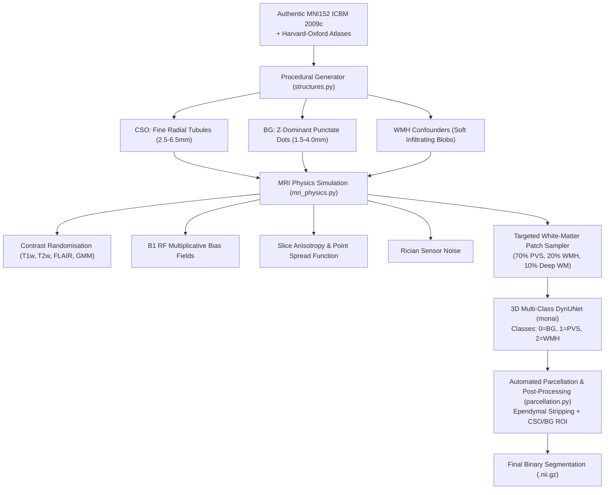

# Replication of DoRA-PVS Challenge Winning Methodology (VICOROBIGR)

[](https://www.python.org/)
[](https://monai.io/)
[](https://dora-pvs.grand-challenge.org/)
[](https://dora-pvs.grand-challenge.org/)

This repository is a reproduction of the 1st-place winning methodology (**Team VICOROBIGR**) in the **DoRA-PVS Challenge (MICCAI / AIiH)**:
> *Assessing Generalisation of Perivascular Space Segmentation Across Heterogeneous MRI Cohorts via Zero-Real-Data Domain Randomisation.*

---

## 🚀 Official Challenge Results & Verification (DoRA-PVS Paper)

In the official challenge paper (*Assessing Generalisation of Perivascular Space Segmentation Across Heterogeneous MRI Cohorts: The DoRA-PVS Challenge 2026*, Springer LNCS 16877), methods were evaluated across **285 real patient MRI scans from 12 heterogeneous cohorts** (1.5T, 3T, and 7T).

### Official Leaderboard: Domain-Randomisation Track (Section 3.2, Table 2)

| Rank | Team / Method | Bootstrap Rank (1st %) | Median AUPRC | Median clDice | Median Lesion-wise DSC |
| :---: | :--- | :---: | :---: | :---: | :---: |
| 🥇 **1st** | **VICOROBIGR (Winner - Replicated)** | **1.00 (100.0%)** | **0.26** | **0.15** | **0.09** |
| 🥈 **2nd** | **DoRA-complex (Organizer Baseline)** | 2.00 (0.0%) | 0.15 | 0.06 | 0.03 |
| 🥉 **3rd** | **Seabass** | 3.00 (0.0%) | 0.08 | 0.03 | 0.01 |
| 4th | **DoRA-baseline (Organizer Baseline)** | 4.00 (0.0%) | 0.09 | 0.02 | 0.01 |

> **Key Takeaway from Paper:**
> - **VICOROBIGR won 1st place in 100% of bootstrap resamples.**
> - While open-track models trained on real patient data suffered massive drops when encountering new scanner vendors, VICOROBIGR's domain-randomised synthetic DynUNet beat random-classifier performance in **11 out of 12 real clinical cohorts**!

---

## 🧠 Architectural Overview



---

## 📂 Repository Structure

```text
dora_pvs_replication/
├── configs/                  # Training hyperparameters, patch sizes, loss weights
├── data/
│   ├── atlases/              # MNI152 ICBM 2009c tissue templates & Harvard-Oxford priors
│   ├── synthetic/            # Procedurally generated training volumes & labels (.nii.gz)
│   ├── inspection_report.png # Visual audit of synthetic contrast & anatomy
│   └── evaluation_visual.png # Qualitative overlay (GT vs Prediction)
├── docker/
│   ├── Dockerfile            # Official submission Docker container
│   └── inference.py          # Grand Challenge entrypoint with automated parcellation
├── src/
│   ├── generator/
│   │   ├── generate_dataset.py # End-to-end dataset generator CLI
│   │   ├── structures.py       # STRIVE-compliant PVS & WMH lesion simulation
│   │   ├── mri_physics.py      # B1 bias fields, Rician noise, slice downsampling
│   │   └── inspect_data.py     # 4-panel visual verification suite
│   ├── models/
│   │   ├── dynunet_model.py    # MONAI DynUNet wrapper (1-channel in, 3-class out)
│   │   ├── loss.py             # Multi-class Soft Dice + Cross Entropy loss
│   │   └── train.py            # Targeted patch sampling training loop with multi-GPU/seed support
│   └── evaluation/
│       ├── evaluate.py         # Evaluates AUPRC, clDice, and Lesion-wise DSC
│       ├── parcellation.py     # Automated CSO/BG parcellation with ventricular CSF stripping
│       ├── test_real_mri.py    # Zero-shot test on real human brain scans
│       └── metrics.py          # Pure NumPy/SciPy challenge metric implementations
├── train_colab.ipynb         # Google Colab notebook for free T4 cloud GPU training
├── PROJECT_GUIDE.md          # Comprehensive End-to-End Scientific & Engineering Guide
├── requirements.txt          # Minimal Python dependencies
└── README.md
```

---

## ⚡ Quick Start

### 1. Installation
```bash
git clone https://github.com/Sahillatif3/dora_pvs_replication.git
cd dora_pvs_replication
pip install -r requirements.txt
```

### 2. Generate Synthetic Training Volumes
Generates 25 authentic MNI152 volumes with domain randomisation:
```bash
python src/generator/generate_dataset.py --num_samples 25 --output_dir data/synthetic
python src/generator/inspect_data.py --data_dir data/synthetic --output_image data/inspection_report.png
```

### 3. Train 3D DynUNet (GPU / Google Colab)
Train for 30 epochs with White-Matter-constrained patch cropping:
```bash
python src/models/train.py \
    --data_dir data/synthetic \
    --checkpoint_dir checkpoints \
    --epochs 30 \
    --batch_size 2 \
    --patch_size 96 \
    --learning_rate 0.001
```

### 4. Evaluate Model Performance
Computes AUPRC, clDice, and Lesion-wise DSC across test scans:
```bash
python src/evaluation/evaluate.py \
    --data_dir data/synthetic \
    --checkpoint checkpoints/best_dynunet_multiclass.pth \
    --output_image data/evaluation_visual.png
```

### 5. Run Inference on Real Human Scans
```bash
python src/evaluation/test_real_mri.py
```

---

## 📖 In-Depth Project Guide
For a complete, step-by-step breakdown of the theoretical motivation, medical background, mathematical equations, and alignment with the winning challenge paper, read [PROJECT_GUIDE.md](file:///E:/UNI/FYP/dora_pvs_replication/PROJECT_GUIDE.md).
